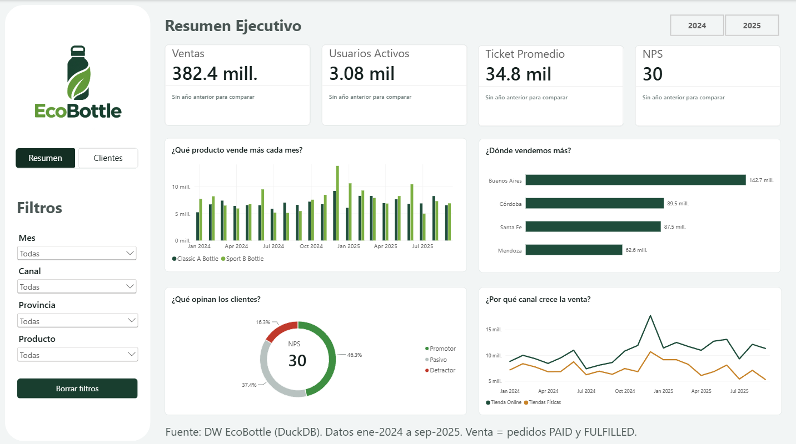
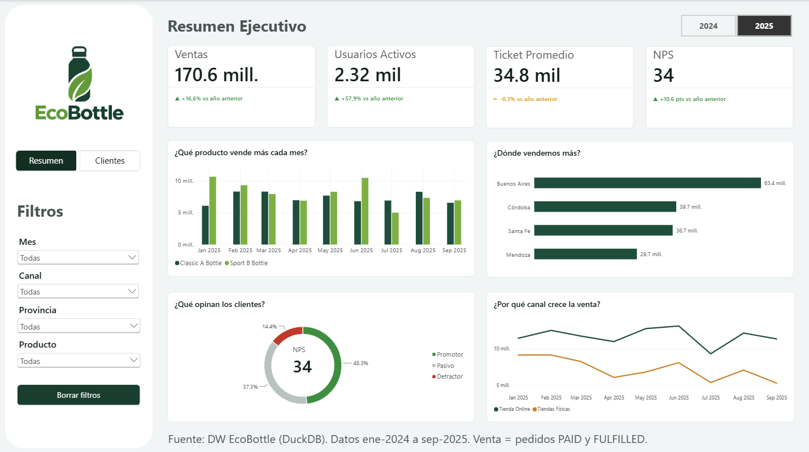
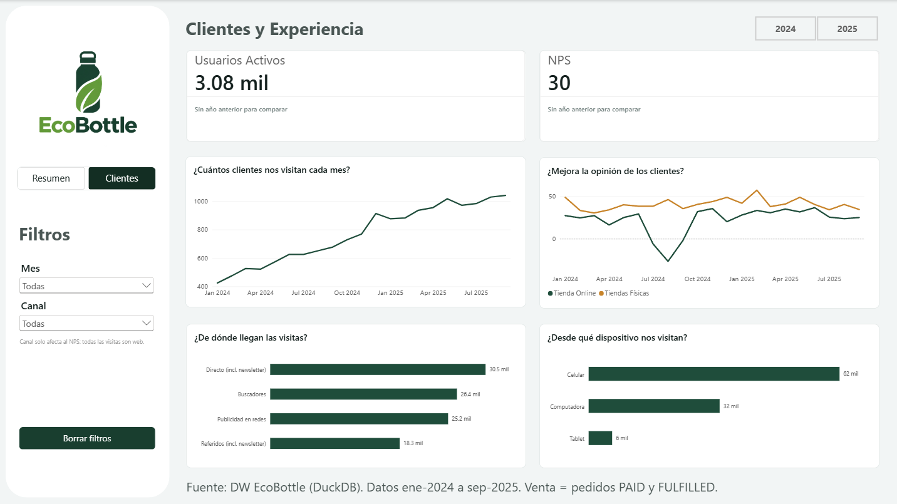

# EcoBottle AR — Data warehouse y tablero comercial

Trabajo práctico de **Introducción al Marketing Online y los Negocios Digitales**.

Se transforman los datos transaccionales de EcoBottle AR (`raw/`) en un **modelo estrella (Kimball)** con DuckDB. El resultado (`dw/`) alimenta un tablero comercial con los KPIs que monitorea el management: Ventas, Usuarios Activos, Ticket Promedio, NPS, Ventas por Provincia y Ranking Mensual por Producto.

- **Consigna:** [Práctica](https://docs.google.com/document/d/15RNP3FVqLjO4jzh80AAkK6mUR5DOLqPxLjQxqvdzrYg/edit?usp=sharing)
- **Repositorio original:** [AugustoCarmona/practica-imond](https://github.com/AugustoCarmona/practica-imond)
- **Tablero (Power BI):** [`tablero/EcoBottle_tablero.pbix`](./tablero/EcoBottle_tablero.pbix), con capturas en la sección [Tablero](#tablero)

## Contenido

1. [Estructura del repositorio](#estructura-del-repositorio)
2. [Cómo ejecutarlo](#cómo-ejecutarlo)
3. [Modelo estrella](#modelo-estrella)
4. [Supuestos y decisiones](#supuestos-y-decisiones)
5. [Diccionario de datos](#diccionario-de-datos)
6. [Consultas clave (KPIs)](#consultas-clave-kpis)
7. [Validaciones](#validaciones)
8. [Tablero](#tablero)
9. [Hallazgos](#hallazgos)
10. [Anexo: versión en Looker Studio](#anexo-versión-en-looker-studio)

## Estructura del repositorio

```
raw/                     datos de origen (CSV, no se modifican)
sql/
  01_dimensiones.sql     11 dimensiones
  02_hechos.sql          6 tablas de hechos + 1 agregado
  03_consultas.sql       validaciones, KPIs y consultas de hallazgos
  04_looker.sql          tablas planas para Looker Studio (versión alternativa del tablero)
dw/                      data warehouse exportado en CSV (fuente del tablero)
  modelo_estrella.md     diagrama completo del modelo (generado)
tablero/
  EcoBottle_tablero.pbix tablero en Power BI
  tema_ecobottle.json    tema de colores y tipografía del tablero
img/                     capturas del tablero
run_sql.py               ejecuta los SQL, arma warehouse.duckdb y exporta dw/
requirements.txt         dependencias (DuckDB)
assets/DER.png           diagrama de las tablas de origen
generator/               generador de los datos de raw/ (referencia)
```

## Cómo ejecutarlo

Requisitos: Python 3.9 o superior y Git.

```bash
git clone URL-DE-ESTE-REPO
cd practica-imond
python -m venv .venv
source .venv/bin/activate          # Windows: .venv\Scripts\activate
pip install -r requirements.txt
python run_sql.py
```

`run_sql.py`:

1. Crea `warehouse.duckdb` desde cero.
2. Ejecuta los archivos de `sql/` en orden (`01` a `04`), y muestra en la terminal el resultado de cada consulta.
3. Exporta cada tabla a `dw/<tabla>.csv`.
4. Genera `dw/modelo_estrella.md` con el diagrama del modelo.

Otros modos:

```bash
python run_sql.py --explorar   # consola sobre raw/ sin ejecutar sql/
python run_sql.py --ui         # arma el DW y abre la interfaz web de DuckDB
```

## Modelo estrella

Diagrama simplificado (solo relaciones). El diagrama completo, con columnas y tipos, está en [`dw/modelo_estrella.md`](./dw/modelo_estrella.md).

```mermaid
erDiagram
    dim_date ||--o{ fact_sales_order : "order_date_key"
    dim_customer ||--o{ fact_sales_order : "customer_key"
    dim_channel ||--o{ fact_sales_order : "channel_key"
    dim_store ||--o{ fact_sales_order : "store_key"
    dim_province ||--o{ fact_sales_order : "province_key"
    dim_order_status ||--o{ fact_sales_order : "order_status_key"
    dim_payment_method ||--o{ fact_sales_order : "payment_method_key"

    dim_date ||--o{ fact_sales_order_item : "order_date_key"
    dim_product ||--o{ fact_sales_order_item : "product_key"
    dim_channel ||--o{ fact_sales_order_item : "channel_key"
    dim_province ||--o{ fact_sales_order_item : "province_key"

    dim_date ||--o{ fact_web_session : "date_key"
    dim_customer ||--o{ fact_web_session : "customer_key"
    dim_traffic_source ||--o{ fact_web_session : "traffic_source_key"
    dim_device ||--o{ fact_web_session : "device_key"

    dim_date ||--o{ fact_nps_response : "date_key"
    dim_customer ||--o{ fact_nps_response : "customer_key"
    dim_channel ||--o{ fact_nps_response : "channel_key"

    dim_date ||--o{ fact_payment : "order_date_key / paid_date_key"
    dim_payment_method ||--o{ fact_payment : "payment_method_key"
    dim_date ||--o{ fact_shipment : "order / shipped / delivered"
    dim_province ||--o{ fact_shipment : "province_key"

    dim_date ||--o{ agg_sales_product_month : "month_date_key"
    dim_product ||--o{ agg_sales_product_month : "product_key"
```



### Tablas de hechos y su grano

| Tabla | Una fila es… | KPI que alimenta |
|---|---|---|
| `fact_sales_order` | un pedido | Ventas, Ticket Promedio, Ventas por Provincia |
| `fact_sales_order_item` | un producto dentro de un pedido | Ranking por producto |
| `fact_payment` | un pago | Conciliación y rechazos de pago |
| `fact_shipment` | un envío por correo | Tiempos de entrega |
| `fact_web_session` | una visita a la web | Usuarios Activos |
| `fact_nps_response` | una respuesta de la encuesta NPS | NPS |
| `agg_sales_product_month` | un producto en un mes | Ranking mensual (precalculado) |

Hay dos hechos de ventas porque los KPIs piden dos granos distintos. El pedido tiene `total_amount`, con IVA y envío, que se usa para Ventas y Ticket. La línea tiene `line_total` por producto, que se usa para el Ranking. Bajar `total_amount` a nivel línea obligaría a repartir el envío entre productos con un criterio arbitrario.

## Supuestos y decisiones

**Reglas de negocio** (vienen del README original y se verificaron en los datos):

- **Venta válida:** pedido con estado `PAID` o `FULFILLED`. La regla está en un solo lugar, `dim_order_status.is_sale`, y se copia a los hechos como `is_sale` y `sales_amount`. Así no hay que repetir el filtro en cada consulta ni en cada medida.
- **Montos:** en pesos argentinos (ARS). `total_amount` = subtotal + IVA (21 %) + costo de envío. Ventas y Ticket se calculan sobre `total_amount`, como define la consigna.
- **Canal:** un `store_id` vacío indica pedido online.

**Decisiones de modelado:**

- **Claves subrogadas** (`*_key`, números propios del DW) en todas las dimensiones. Las claves naturales (`*_id`) se conservan para trazabilidad.
- **Miembro "Desconocido" con clave `-1`:** cliente anónimo en sesiones y NPS, tienda en pedidos online ("Tienda online"), y valores faltantes de origen de tráfico y dispositivo. Así ninguna FK de dimensión queda nula y el tablero no pierde filas al relacionar tablas.
- **Fechas opcionales:** las de pago, despacho y entrega quedan `NULL` si el evento todavía no pasó. Ponerles `-1` equivaldría a inventar una fecha.
- **Provincia de la venta:** se toma de la dirección de envío. En las compras en tienda esa dirección es la de la tienda (4.443 de 4.683 pedidos offline). Las 240 ventas de tienda enviadas a domicilio se asignan a la provincia del cliente. Ningún pedido quedó sin provincia.
- **Usuarios Activos:** clientes logueados **distintos** en `web_session` durante el período. El 70 % de las sesiones son anónimas (70.751 de 100.363). La consigna sugiere contar `session_id` para los anónimos, pero eso mezcla dos unidades: un visitante con 10 visitas contaría como 10 usuarios. Por eso las sesiones anónimas se guardan, para analizar tráfico, pero no se cuentan como usuarios. **Consecuencia:** el KPI subestima la audiencia real; es "clientes identificados activos". Además, como es un conteo de distintos, no es sumable: la suma de los usuarios de cada mes no da los usuarios del año. En Power BI no es un problema, porque `DISTINCTCOUNT` se calcula sobre el período filtrado: la tarjeta muestra los clientes distintos del período y la serie muestra los de cada mes (MAU). En la versión de Looker Studio se muestra el MAU promedio (ver [Anexo](#anexo-versión-en-looker-studio)).
- **NPS:** promotores (9-10) menos detractores (0-6), sobre el total de respuestas, multiplicado por 100. La encuesta no tiene número de pedido, así que el NPS se cruza por cliente, canal y fecha de respuesta, no por pedido.
- **Datos personales:** `dim_customer` no guarda email ni teléfono porque el tablero no los necesita (minimización de datos).
- **`dim_customer.province_name`:** la provincia donde el cliente recibe más pedidos, sin contar direcciones de tiendas. Queda vacía para los clientes que solo compraron en tienda.
- **`agg_sales_product_month`:** agregado precalculado sin canal ni provincia, así que **no responde a esos filtros**. Para un ranking filtrable, el tablero usa `fact_sales_order_item`.

## Diccionario de datos

Convenciones: `PK` = clave primaria, `FK` = clave foránea. Los importes son `DECIMAL(12,2)` en ARS. Las claves de fecha son enteros con formato `AAAAMMDD`.

### Dimensiones

**`dim_date`**: calendario del 01/01/2024 al 31/10/2025. Es una dimensión de rol: la usan las fechas de pedido, pago, despacho, entrega, sesión y NPS.

| Columna | Tipo | Descripción |
|---|---|---|
| `date_key` | INTEGER PK | Fecha como AAAAMMDD |
| `date` | DATE | Fecha |
| `year`, `quarter`, `month`, `day` | INTEGER | Partes de la fecha |
| `month_name` | VARCHAR | Enero … Diciembre |
| `year_month` | VARCHAR | `2024-01`; ordena bien como texto |
| `month_start` | DATE | Primer día del mes; eje de las series mensuales |
| `day_of_week` | INTEGER | 1 = lunes … 7 = domingo (ISO) |
| `day_name` | VARCHAR | Lunes … Domingo |
| `is_weekend` | BOOLEAN | Sábado o domingo |

**`dim_channel`**: canal de venta.

| Columna | Tipo | Descripción |
|---|---|---|
| `channel_key` | INTEGER PK | Clave subrogada |
| `channel_id` | INTEGER | Clave natural (`raw.channel`) |
| `code` | VARCHAR | `ONLINE` / `OFFLINE` |
| `name` | VARCHAR | Tienda Online / Tiendas Físicas |

**`dim_province`**: provincia de la venta.

| Columna | Tipo | Descripción |
|---|---|---|
| `province_key` | INTEGER PK | Clave subrogada (-1 = Desconocida) |
| `province_id` | INTEGER | Clave natural |
| `name` | VARCHAR | Buenos Aires, Córdoba, Santa Fe, Mendoza |
| `code` | VARCHAR | BA, CBA, SF, MZA |
| `iso_code` | VARCHAR | Código ISO 3166-2 (AR-B, AR-X, AR-S, AR-M); lo usa el mapa |
| `country_name` | VARCHAR | Argentina |

**`dim_store`**: tienda física.

| Columna | Tipo | Descripción |
|---|---|---|
| `store_key` | INTEGER PK | Clave subrogada (-1 = Tienda online) |
| `store_id` | INTEGER | Clave natural (NULL en la fila -1) |
| `name` | VARCHAR | Nombre de la tienda |
| `city`, `province_name` | VARCHAR | Ubicación de la tienda |
| `is_physical` | BOOLEAN | FALSE solo en la fila -1 |

**`dim_customer`**: cliente.

| Columna | Tipo | Descripción |
|---|---|---|
| `customer_key` | INTEGER PK | Clave subrogada (-1 = Anónimo) |
| `customer_id` | INTEGER | Clave natural |
| `full_name` | VARCHAR | Nombre y apellido |
| `status` | VARCHAR | Activo / Inactivo / Desconocido |
| `created_date` | DATE | Fecha de alta |
| `cohort_month` | VARCHAR | Mes de alta (AAAA-MM), para cohortes |
| `province_name` | VARCHAR | Provincia de entrega más frecuente |

**`dim_product`**: producto, con la jerarquía de categorías aplanada.

| Columna | Tipo | Descripción |
|---|---|---|
| `product_key` | INTEGER PK | Clave subrogada |
| `product_id` | INTEGER | Clave natural |
| `sku` | VARCHAR | Código de producto |
| `name` | VARCHAR | Classic A Bottle / Sport B Bottle |
| `category` | VARCHAR | Classic / Sport |
| `family` | VARCHAR | Bottles (categoría padre) |
| `list_price` | DECIMAL | Precio de lista sin IVA |

**`dim_order_status`**

| Columna | Tipo | Descripción |
|---|---|---|
| `order_status_key` | INTEGER PK | 1 a 5 |
| `status_code` | VARCHAR | CREATED, PAID, FULFILLED, CANCELLED, REFUNDED |
| `description` | VARCHAR | Descripción en castellano |
| `is_sale` | BOOLEAN | TRUE solo para PAID y FULFILLED |

**`dim_payment_method`**: `payment_method_key` (PK), `method_code` (CASH, CARD, TRANSFER, GATEWAY), `description`.

**`dim_traffic_source`**: `traffic_source_key` (PK, -1 = Desconocido), `source_code` (ads, direct, referral, organic), `description`, `is_paid` (TRUE para `ads`).

**`dim_device`**: `device_key` (PK, -1 = Desconocido), `device_code` (desktop, mobile, tablet), `description`.

### Hechos

**`fact_sales_order`**: un pedido.

| Columna | Tipo | Descripción |
|---|---|---|
| `order_id` | BIGINT PK | Número de pedido (dimensión degenerada) |
| `order_date_key` | INTEGER FK → dim_date | Fecha del pedido |
| `customer_key` | INTEGER FK → dim_customer | Cliente |
| `channel_key` | INTEGER FK → dim_channel | Canal |
| `store_key` | INTEGER FK → dim_store | Tienda (-1 si es online) |
| `province_key` | INTEGER FK → dim_province | Provincia de la dirección de envío |
| `order_status_key` | INTEGER FK → dim_order_status | Estado |
| `payment_method_key` | INTEGER FK → dim_payment_method | Medio de pago |
| `is_sale` | BOOLEAN | Cuenta como venta (PAID / FULFILLED) |
| `item_lines`, `units` | INTEGER | Cantidad de líneas y de unidades |
| `subtotal` | DECIMAL | Suma de `line_total`, sin IVA |
| `discount_amount` | DECIMAL | Descuentos del pedido |
| `tax_amount` | DECIMAL | IVA (21 % del subtotal) |
| `shipping_fee` | DECIMAL | Costo de envío |
| `total_amount` | DECIMAL | subtotal + IVA + envío |
| `sales_amount` | DECIMAL | `total_amount` si `is_sale`; si no, 0 |

**`fact_sales_order_item`**: un producto dentro de un pedido. Repite las claves del pedido (fecha, canal, tienda, provincia, estado) para poder filtrarse igual que las ventas.

| Columna | Tipo | Descripción |
|---|---|---|
| `order_item_id` | BIGINT PK | Línea de pedido |
| `order_id` | BIGINT | Pedido (degenerada) |
| `product_key` | INTEGER FK → dim_product | Producto |
| `order_date_key`, `customer_key`, `channel_key`, `store_key`, `province_key`, `order_status_key` | INTEGER FK | Heredadas del pedido |
| `is_sale` | BOOLEAN | Heredado del pedido |
| `quantity` | INTEGER | Unidades |
| `unit_price` | DECIMAL | Precio unitario |
| `discount_amount` | DECIMAL | Descuento de la línea |
| `line_total` | DECIMAL | quantity × unit_price − descuento, sin IVA |
| `sales_line_total` | DECIMAL | `line_total` si `is_sale`; si no, 0 |

**`fact_payment`**: un pago.

| Columna | Tipo | Descripción |
|---|---|---|
| `payment_id` | BIGINT PK | Pago |
| `order_id` | BIGINT | Pedido |
| `order_date_key` | INTEGER FK → dim_date | Fecha del pedido |
| `paid_date_key` | INTEGER FK → dim_date | Fecha de cobro (NULL si no se cobró) |
| `channel_key`, `payment_method_key` | INTEGER FK | Canal y medio de pago |
| `payment_status` | VARCHAR | PENDING, PAID, FAILED, REFUNDED |
| `amount` | DECIMAL | Monto |
| `minutes_to_pay` | INTEGER | Minutos entre el pedido y el cobro |

**`fact_shipment`**: un envío por correo.

| Columna | Tipo | Descripción |
|---|---|---|
| `shipment_id` | BIGINT PK | Envío |
| `order_id` | BIGINT | Pedido |
| `order_date_key`, `shipped_date_key`, `delivered_date_key` | INTEGER FK → dim_date | Pedido, despacho y entrega (las dos últimas pueden ser NULL) |
| `channel_key`, `store_key`, `province_key` | INTEGER FK | Heredadas del pedido |
| `carrier` | VARCHAR | Correo |
| `shipment_status` | VARCHAR | READY, SHIPPED, DELIVERED, CANCELLED |
| `hours_to_ship` | DECIMAL | Horas entre el pedido y el despacho |
| `days_to_deliver` | DECIMAL | Días entre el despacho y la entrega |
| `days_order_to_door` | DECIMAL | Días entre el pedido y la entrega |

**`fact_web_session`**: una visita a la web.

| Columna | Tipo | Descripción |
|---|---|---|
| `session_id` | BIGINT PK | Sesión |
| `date_key` | INTEGER FK → dim_date | Fecha de inicio |
| `customer_key` | INTEGER FK → dim_customer | Cliente (-1 = anónimo) |
| `traffic_source_key` | INTEGER FK → dim_traffic_source | Origen de la visita |
| `device_key` | INTEGER FK → dim_device | Dispositivo |
| `is_logged_in` | BOOLEAN | El visitante inició sesión |
| `duration_seconds` | INTEGER | Duración (NULL si no tiene fin registrado) |

**`fact_nps_response`**: una respuesta de la encuesta.

| Columna | Tipo | Descripción |
|---|---|---|
| `nps_id` | BIGINT PK | Respuesta |
| `date_key` | INTEGER FK → dim_date | Fecha de respuesta |
| `customer_key` | INTEGER FK → dim_customer | Cliente (-1 = anónimo) |
| `channel_key` | INTEGER FK → dim_channel | Canal |
| `score` | SMALLINT | Puntaje de 0 a 10 |
| `nps_group` | VARCHAR | Promotor / Pasivo / Detractor |
| `is_promoter`, `is_passive`, `is_detractor` | INTEGER | Indicadores 1/0 para calcular el NPS |
| `has_comment` | BOOLEAN | Dejó comentario |
| `comment` | VARCHAR | Texto del comentario |

**`agg_sales_product_month`**: un producto en un mes. PK compuesta (`month_date_key`, `product_key`).

| Columna | Tipo | Descripción |
|---|---|---|
| `month_date_key` | INTEGER FK → dim_date | Primer día del mes |
| `product_key` | INTEGER FK → dim_product | Producto |
| `units` | INTEGER | Unidades vendidas |
| `sales_amount` | DECIMAL | Suma de `line_total` de ventas válidas |
| `rank_in_month` | INTEGER | 1 = el que más facturó ese mes |
| `share_of_month` | DECIMAL | Participación en el mes (0 a 1) |

## Consultas clave (KPIs)

Están todas en [`sql/03_consultas.sql`](./sql/03_consultas.sql), parte B. Las más importantes:

**Ventas y Ticket Promedio**

```sql
SELECT
    SUM(sales_amount)                                   AS ventas,
    SUM(sales_amount) / COUNT(*) FILTER (WHERE is_sale) AS ticket_promedio
FROM fact_sales_order;
```

**Usuarios Activos por mes**

```sql
SELECT d.year_month, COUNT(DISTINCT w.customer_key) AS usuarios_activos
FROM fact_web_session AS w
JOIN dim_date AS d ON d.date_key = w.date_key
WHERE w.is_logged_in
GROUP BY d.year_month;
```

**NPS**

```sql
SELECT (SUM(is_promoter) - SUM(is_detractor)) * 100.0 / COUNT(*) AS nps
FROM fact_nps_response;
```

**Ventas por provincia**

```sql
SELECT p.name, SUM(f.sales_amount) AS ventas
FROM fact_sales_order AS f
JOIN dim_province AS p ON p.province_key = f.province_key
GROUP BY p.name;
```

**Ranking mensual por producto**

```sql
SELECT d.year_month, p.name, i.product_key,
       SUM(i.sales_line_total) AS ventas,
       RANK() OVER (PARTITION BY d.year_month ORDER BY SUM(i.sales_line_total) DESC) AS puesto
FROM fact_sales_order_item AS i
JOIN dim_date    AS d ON d.date_key    = i.order_date_key
JOIN dim_product AS p ON p.product_key = i.product_key
GROUP BY d.year_month, p.name, i.product_key;
```

### Resultados del período completo (01/2024 a 09/2025)

| KPI | Valor |
|---|---|
| Ventas | $382,4M |
| Pedidos válidos | 10.998 |
| Ticket promedio | $34,8K |
| Usuarios activos: clientes logueados distintos en todo el período (tarjeta de Power BI) | 3.077 |
| Usuarios activos mensuales (MAU) promedio (tarjeta de Looker) | 771 |
| NPS | 30 |

## Validaciones

La parte A de `03_consultas.sql` verifica que el modelo cuadre con `raw/`:

| Control | Resultado |
|---|---|
| Cada hecho tiene las mismas filas que su tabla de origen | ✅ 6 de 6 |
| Ventas del DW = ventas calculadas directo sobre `raw.sales_order` | ✅ $382.410.636 en ambos |
| Pedidos sin provincia asignada | ✅ 0 |
| Pedidos cuyas líneas no suman el subtotal | ✅ 0 |
| Claves foráneas válidas | ✅ DuckDB rechaza la carga si alguna falla |

## Tablero

Herramienta: **Power BI Desktop**. Archivo: [`tablero/EcoBottle_tablero.pbix`](./tablero/EcoBottle_tablero.pbix). Tiene dos páginas, **Resumen** y **Clientes**, con un menú lateral compartido (navegación, filtros y botón para borrarlos).







### Carga y modelo

- Se importan los CSV del modelo estrella de `dw/` (dimensiones y hechos). Las tablas `looker_*` no se usan en Power BI.
- **Configuración regional de importación: Inglés (Estados Unidos).** Los CSV usan punto decimal; con la configuración en español, Power BI lee `34812.50` como 3.481.250.
- **Detección automática de relaciones y "Fecha/hora automática": desactivadas.** Las relaciones se crean a mano, siguiendo las FK del diagrama: 10 relaciones 1 a N, de la dimensión al hecho, todas activas y con filtro en una sola dirección. Así el modelo de Power BI es el mismo modelo estrella del DW.
- Tema propio: [`tablero/tema_ecobottle.json`](./tablero/tema_ecobottle.json), con los colores del logo.

### Medidas DAX principales

```dax
Ventas           = SUM ( fact_sales_order[sales_amount] )

Pedidos válidos  = CALCULATE ( COUNTROWS ( fact_sales_order ), fact_sales_order[is_sale] = TRUE () )

Ticket Promedio  = DIVIDE ( [Ventas], [Pedidos válidos] )

Usuarios Activos = CALCULATE ( DISTINCTCOUNT ( fact_web_session[customer_key] ),
                       fact_web_session[customer_key] <> -1 )

NPS              = DIVIDE ( SUM ( fact_nps_response[is_promoter] ) - SUM ( fact_nps_response[is_detractor] ),
                       COUNTROWS ( fact_nps_response ) ) * 100

Sesiones         = COUNTROWS ( fact_web_session )
```

La regla "solo PAID y FULFILLED son venta" no se repite en DAX: ya viene resuelta en `sales_amount` e `is_sale` desde el DW.

`Usuarios Activos` excluye la clave `-1` (visitante anónimo). En los datos, una sesión tiene cliente conocido si y solo si está logueada (29.612 sesiones), así que es equivalente a filtrar por `is_logged_in`.

### Comparación contra el año anterior

Cada tarjeta muestra la variación contra el mismo período del año anterior (por ejemplo, **▲ +16,6 % vs año anterior**), en verde si sube más de 1 %, en rojo si baja más de 1 % y en ámbar si queda estable. El NPS se compara en **puntos**, no en porcentaje, porque ya es un puntaje.

```dax
Ventas PA =
VAR ini = MIN ( dim_date[date] )
VAR fin = MIN ( MAX ( dim_date[date] ), DATE ( 2025, 9, 30 ) )
RETURN
IF ( EDATE ( ini, -12 ) < DATE ( 2024, 1, 1 ), BLANK (),
    CALCULATE ( [Ventas], REMOVEFILTERS ( dim_date ),
        dim_date[date] >= EDATE ( ini, -12 ),
        dim_date[date] <= EDATE ( fin, -12 ) ) )
```

Decisiones:

- **Se corta en el último dato (30/09/2025).** El calendario llega a octubre de 2025, pero los datos terminan en septiembre. Sin el corte, "2025" (9 meses con datos) se compararía con enero–octubre de 2024 y siempre parecería que cae.
- **Sin año anterior, no hay comparación.** Para 2024 o sin filtro de año, la tarjeta dice "Sin año anterior para comparar" en gris, en lugar de mostrar un 0 % que se leería como "no cambió".
- La misma lógica se repite para Usuarios Activos, Ticket Promedio y NPS (medidas `* PA`, `* vs PA` para el texto y `* vs PA Color` para el color).

### Vistas

Los títulos son preguntas de negocio, para que cada gráfico diga qué responde.

| Página | Visual | Datos | KPI de la consigna |
|---|---|---|---|
| Resumen | Tarjetas con comparación | Ventas, Usuarios Activos, Ticket Promedio, NPS | Ventas ($M), Usuarios (nK), Ticket ($K), NPS |
| Resumen | ¿Qué producto vende más cada mes? (columnas) | `year_month` × producto, ventas de línea | Ranking mensual por producto |
| Resumen | ¿Dónde vendemos más? (barras) | provincia, Ventas | Ventas por provincia |
| Resumen | ¿Qué opinan los clientes? (anillo) | promotores / pasivos / detractores, NPS al centro | NPS |
| Resumen | ¿Por qué canal crece la venta? (líneas) | mes × canal, Ventas | Serie temporal de Ventas |
| Clientes | Tarjetas con comparación | Usuarios Activos, NPS | Usuarios, NPS |
| Clientes | ¿Cuántos clientes nos visitan cada mes? (línea) | mes, Usuarios Activos | Serie temporal de Usuarios |
| Clientes | ¿Mejora la opinión de los clientes? (líneas, línea de referencia en 0) | mes × canal, NPS | Tendencia de NPS |
| Clientes | ¿De dónde llegan las visitas? (barras) | origen de tráfico, Sesiones | Contexto de Usuarios |
| Clientes | ¿Desde qué dispositivo nos visitan? (barras) | dispositivo, Sesiones | Contexto de Usuarios |

Las series usan eje de fechas **continuo**, que respeta la distancia real entre meses; el detalle de cada mes se ve al pasar el mouse.

### Filtros y cómo afectan (decisión de diseño)

| Filtro | Páginas | Afecta a |
|---|---|---|
| Año (botones 2024 / 2025) | Resumen y Clientes, sincronizado | Todo |
| Mes | Resumen y Clientes, sincronizado | Todo |
| Canal | Resumen y Clientes, sincronizado | Ventas, Ticket, productos, provincias y NPS. **No** a Usuarios ni Sesiones |
| Provincia | Resumen | Ventas, Ticket y productos (provincia del pedido) |
| Producto | Resumen | Solo el gráfico de productos |

- **Producto** solo filtra el gráfico de productos. Ventas y Ticket se miden por pedido, y un pedido puede tener los dos productos: asignarle su IVA y su envío a uno solo sería arbitrario.
- **Canal** y **Provincia** no filtran Usuarios ni Sesiones: todas las visitas son web y no tienen ubicación. En la página Clientes, una nota debajo del filtro lo aclara.
- **Provincia** no filtra el NPS: la encuesta no tiene pedido, así que no hay provincia de venta para la respuesta.
- **Borrar filtros** usa la acción "Borrar todas las segmentaciones" (en Power BI Desktop, los botones se activan con Ctrl + clic).

## Hallazgos

Las consultas están en la parte C de `03_consultas.sql`. Se distinguen **hechos**, que salen directo de los datos, de **interpretaciones**, que son hipótesis para validar.

1. **En julio y agosto de 2024 el NPS online se desplomó por la demora del correo.** *(Hecho, consulta C7)* El tiempo de despacho a entrega pasó de 3,2–3,9 días (enero a junio) a 7,4 días en julio y 8,0 en agosto. En esos mismos meses el NPS online cayó de 29,2 (junio) a −6,0 (julio) y −26,5 (agosto). Se recuperó cuando volvieron los tiempos normales: −1,9 en septiembre y 31,9 en octubre. El NPS de las tiendas físicas, que no usan envío, no cayó (46,2 en agosto). Los comentarios más repetidos de los detractores online de esos dos meses son "El envío demoró y nadie me avisó", "Tardó mucho más de lo esperado" y "Llegó con la caja dañada". Todos los envíos van por un único correo (Correo Argentino). *(Interpretación, confianza alta)* La caída se explica por la demora de entrega, no por el producto: coinciden las fechas, el canal sin envío funciona como grupo de control y los comentarios lo dicen textualmente. No se puede probar respuesta por respuesta porque la encuesta no tiene número de pedido. **Recomendación:** tener un segundo correo como alternativa y avisar al cliente cuando el envío se demora; "nadie me avisó" sugiere que la falta de aviso empeora la opinión tanto como la demora.

2. **La venta crece por más clientes, no por compras más caras, y todo el crecimiento es online.** *(Hecho, consulta C8)* Comparando enero a septiembre de cada año, las ventas subieron 16,6 % ($146,3M a $170,6M). Los pedidos válidos subieron 16,9 % (4.196 a 4.906) y los clientes identificados que compraron, 39 % (1.624 a 2.264). El ticket promedio quedó estable ($34,87K a $34,78K, −0,3 %). Las ventas online pasaron de $81,2M a $105,3M (+30 %) y las tiendas quedaron planas ($65,1M contra $65,3M). *(Interpretación)* El negocio crece captando clientes por el canal online, no subiendo precios ni el gasto por compra. Como los clientes crecieron más que los pedidos, cada cliente compró en promedio menos veces (2,6 a 2,2 pedidos), lo que es esperable si muchos son nuevos; conviene seguir la recompra. Si las tiendas justifican su costo no se puede evaluar: no hay datos de costos.

3. **El NPS online es más bajo que el de las tiendas y varía por provincia.** *(Hecho)* NPS del período: tiendas físicas 40,9 contra online 24,0. Por provincia del cliente, el NPS online es 35 en Buenos Aires y entre 14 y 19 en Córdoba, Mendoza y Santa Fe; Buenos Aires también tiene los envíos más rápidos (4,0 días del pedido a la puerta, contra 5,7 a 6,0 en las otras). *(Interpretación)* Por sí sola, esta es una correlación entre 4 provincias. Pero el hallazgo 1 muestra el mismo mecanismo en el tiempo, con un grupo de control, así que la hipótesis "la demora del envío baja el NPS" queda bastante respaldada.

4. **Mercado Pago rechaza el doble que la tarjeta.** *(Hecho)* Fallan el 9,8 % de los pagos por pasarela contra el 4,0 % con tarjeta. Las cancelaciones suman 658 pedidos, $22,5M que no se concretaron. *(Interpretación)* Es un punto concreto para recuperar ventas: reintentos o un medio alternativo al momento del rechazo.

5. **Los usuarios activos se duplicaron; la mayoría del tráfico es anónimo y desde el celular.** *(Hecho, consultas B3, C4 y C9)* Los clientes logueados por mes pasaron de 424 (01/2024) a 1.041 (09/2025), y la proporción de sesiones logueadas subió del 21 % al 34 %. El 61,9 % de las visitas es desde el celular, 32,3 % desde computadora y 5,8 % desde tablet. *(Interpretación)* Parte del crecimiento del KPI puede deberse a que más gente inicia sesión, no a que haya más audiencia: el KPI mide clientes identificados, no visitantes. Con 6 de cada 10 visitas desde el celular, la experiencia móvil (incluido el pago) es prioritaria.

6. **Los productos se reparten casi parejo.** *(Hecho)* Sport B lidera en pesos en 12 de los 21 meses, por su precio más alto ($15.000 contra $12.000). Classic A vende más unidades en 15 de los 21 meses. El puesto 1 alterna mes a mes. *(Interpretación)* Con dos productos, un "top N" dice poco: por eso el tablero muestra los dos productos lado a lado cada mes en lugar de solo el primero.

**Ideas para sumar al tablero:** días de entrega por mes junto al NPS online (alerta temprana del hallazgo 1), tasa de conversión de sesión a pedido por origen de tráfico (requiere vincular sesión y pedido, que hoy no se puede), y tasa de rechazo de pago por medio. Para medir el NPS por pedido, agregar `order_id` a la encuesta.

## Anexo: versión en Looker Studio

La consigna menciona Looker Studio en los entregables, así que el repositorio también deja preparada esa versión. Los KPIs dan los mismos valores en las dos herramientas.

Looker Studio no relaciona tablas entre sí como Power BI: cada CSV es una fuente de datos independiente. Por eso `sql/04_looker.sql` arma una **capa de presentación**: tablas planas derivadas del modelo estrella, cada una con los atributos de sus dimensiones ya unidos. No reemplazan al modelo: si cambia una regla, se cambia en `01` o `02` y estas tablas la heredan.

| Fuente en Looker | CSV de `dw/` | Grano | Se usa para |
|---|---|---|---|
| tp_ventas | `looker_ventas.csv` | un pedido | Ventas, Ticket Promedio, Ventas por Provincia |
| tp_productos | `looker_productos.csv` | una línea de pedido | Ranking mensual por producto |
| tp_usuarios_mes | `looker_usuarios_mes.csv` | un mes | Usuarios Activos (MAU) |
| tp_nps | `looker_nps.csv` | una respuesta de encuesta | NPS |

`looker_sesiones.csv` (una visita web) queda disponible para analizar tráfico por origen y dispositivo. Se cargan con el conector **Subida de archivos CSV**.

**Fechas.** Se exportan como texto `AAAAMMDD` (`20240102`). Con el formato `AAAA-MM-DD`, Looker interpretaba mal las fechas de 2024 y el filtro de período las dejaba afuera. En cada fuente se crean dos campos de tipo fecha: **Día** = `PARSE_DATE("%Y%m%d", CAST(fecha AS TEXT))` y **Mes (fecha)** = `PARSE_DATE("%Y%m%d", CAST(mes AS TEXT))`.

**Campos calculados:** Ventas = `SUM(monto_venta)`; Ticket Promedio = `SUM(monto_venta) / SUM(es_venta)`; Usuarios Activos = `AVG(usuarios_activos)`; NPS = `(SUM(es_promotor) - SUM(es_detractor)) / COUNT(respuesta_id) * 100`; Ventas producto = `SUM(monto_venta_linea)`.

**Por qué en Looker Usuarios Activos se precalcula por mes.** `COUNT_DISTINCT` con un filtro de período da un resultado incorrecto: Looker cuenta los distintos de cada día y suma los días ("reagregación errónea"), así que un cliente que entra 10 días cuenta 10 veces. Con el período completo daba 28.764 en lugar de 3.077. Por eso el conteo distinto se hace en DuckDB, por mes (`looker_usuarios_mes`), y la tarjeta muestra el **promedio de usuarios activos mensuales (MAU)** del período, que sí se puede reagregar. Power BI no tiene este problema, porque calcula `DISTINCTCOUNT` sobre el período filtrado.
