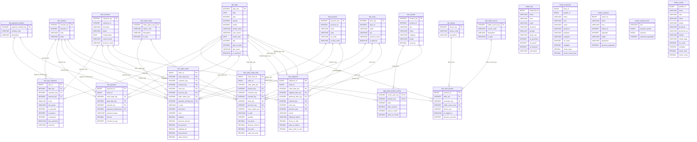

# Modelo estrella

Generado por `run_sql.py` a partir de las tablas de `warehouse.duckdb`.

```mermaid
erDiagram
    dim_channel ||--o{ fact_nps_response : "channel_key"
    dim_channel ||--o{ fact_payment : "channel_key"
    dim_channel ||--o{ fact_sales_order : "channel_key"
    dim_channel ||--o{ fact_sales_order_item : "channel_key"
    dim_channel ||--o{ fact_shipment : "channel_key"
    dim_customer ||--o{ fact_nps_response : "customer_key"
    dim_customer ||--o{ fact_sales_order : "customer_key"
    dim_customer ||--o{ fact_sales_order_item : "customer_key"
    dim_customer ||--o{ fact_web_session : "customer_key"
    dim_date ||--o{ agg_sales_product_month : "month_date_key"
    dim_date ||--o{ fact_nps_response : "date_key"
    dim_date ||--o{ fact_payment : "order_date_key"
    dim_date ||--o{ fact_payment : "paid_date_key"
    dim_date ||--o{ fact_sales_order : "order_date_key"
    dim_date ||--o{ fact_sales_order_item : "order_date_key"
    dim_date ||--o{ fact_shipment : "delivered_date_key"
    dim_date ||--o{ fact_shipment : "order_date_key"
    dim_date ||--o{ fact_shipment : "shipped_date_key"
    dim_date ||--o{ fact_web_session : "date_key"
    dim_device ||--o{ fact_web_session : "device_key"
    dim_order_status ||--o{ fact_sales_order : "order_status_key"
    dim_order_status ||--o{ fact_sales_order_item : "order_status_key"
    dim_payment_method ||--o{ fact_payment : "payment_method_key"
    dim_payment_method ||--o{ fact_sales_order : "payment_method_key"
    dim_product ||--o{ agg_sales_product_month : "product_key"
    dim_product ||--o{ fact_sales_order_item : "product_key"
    dim_province ||--o{ fact_sales_order : "province_key"
    dim_province ||--o{ fact_sales_order_item : "province_key"
    dim_province ||--o{ fact_shipment : "province_key"
    dim_store ||--o{ fact_sales_order : "store_key"
    dim_store ||--o{ fact_sales_order_item : "store_key"
    dim_store ||--o{ fact_shipment : "store_key"
    dim_traffic_source ||--o{ fact_web_session : "traffic_source_key"
    agg_sales_product_month {
        INTEGER month_date_key PK, FK
        INTEGER product_key PK, FK
        INTEGER units
        DECIMAL sales_amount
        INTEGER rank_in_month
        DECIMAL share_of_month
    }
    dim_channel {
        INTEGER channel_key PK
        INTEGER channel_id
        VARCHAR code
        VARCHAR name
    }
    dim_customer {
        INTEGER customer_key PK
        INTEGER customer_id
        VARCHAR full_name
        VARCHAR status
        DATE created_date
        VARCHAR cohort_month
        VARCHAR province_name
    }
    dim_date {
        INTEGER date_key PK
        DATE date
        INTEGER year
        INTEGER quarter
        INTEGER month
        VARCHAR month_name
        VARCHAR year_month
        DATE month_start
        INTEGER day
        INTEGER day_of_week
        VARCHAR day_name
        BOOLEAN is_weekend
    }
    dim_device {
        INTEGER device_key PK
        VARCHAR device_code
        VARCHAR description
    }
    dim_order_status {
        INTEGER order_status_key PK
        VARCHAR status_code
        VARCHAR description
        BOOLEAN is_sale
    }
    dim_payment_method {
        INTEGER payment_method_key PK
        VARCHAR method_code
        VARCHAR description
    }
    dim_product {
        INTEGER product_key PK
        INTEGER product_id
        VARCHAR sku
        VARCHAR name
        VARCHAR category
        VARCHAR family
        DECIMAL list_price
    }
    dim_province {
        INTEGER province_key PK
        INTEGER province_id
        VARCHAR name
        VARCHAR code
        VARCHAR iso_code
        VARCHAR country_name
    }
    dim_store {
        INTEGER store_key PK
        INTEGER store_id
        VARCHAR name
        VARCHAR city
        VARCHAR province_name
        BOOLEAN is_physical
    }
    dim_traffic_source {
        INTEGER traffic_source_key PK
        VARCHAR source_code
        VARCHAR description
        BOOLEAN is_paid
    }
    fact_nps_response {
        BIGINT nps_id PK
        INTEGER date_key FK
        INTEGER customer_key FK
        INTEGER channel_key FK
        SMALLINT score
        VARCHAR nps_group
        INTEGER is_promoter
        INTEGER is_passive
        INTEGER is_detractor
        BOOLEAN has_comment
        VARCHAR comment
    }
    fact_payment {
        BIGINT payment_id PK
        BIGINT order_id
        INTEGER order_date_key FK
        INTEGER paid_date_key FK
        INTEGER channel_key FK
        INTEGER payment_method_key FK
        VARCHAR payment_status
        DECIMAL amount
        INTEGER minutes_to_pay
    }
    fact_sales_order {
        BIGINT order_id PK
        INTEGER order_date_key FK
        INTEGER customer_key FK
        INTEGER channel_key FK
        INTEGER store_key FK
        INTEGER province_key FK
        INTEGER order_status_key FK
        INTEGER payment_method_key FK
        BOOLEAN is_sale
        INTEGER item_lines
        INTEGER units
        DECIMAL subtotal
        DECIMAL discount_amount
        DECIMAL tax_amount
        DECIMAL shipping_fee
        DECIMAL total_amount
        DECIMAL sales_amount
    }
    fact_sales_order_item {
        BIGINT order_item_id PK
        BIGINT order_id
        INTEGER order_date_key FK
        INTEGER product_key FK
        INTEGER customer_key FK
        INTEGER channel_key FK
        INTEGER store_key FK
        INTEGER province_key FK
        INTEGER order_status_key FK
        BOOLEAN is_sale
        INTEGER quantity
        DECIMAL unit_price
        DECIMAL discount_amount
        DECIMAL line_total
        DECIMAL sales_line_total
    }
    fact_shipment {
        BIGINT shipment_id PK
        BIGINT order_id
        INTEGER order_date_key FK
        INTEGER shipped_date_key FK
        INTEGER delivered_date_key FK
        INTEGER channel_key FK
        INTEGER store_key FK
        INTEGER province_key FK
        VARCHAR carrier
        VARCHAR shipment_status
        DECIMAL hours_to_ship
        DECIMAL days_to_deliver
        DECIMAL days_order_to_door
    }
    fact_web_session {
        BIGINT session_id PK
        INTEGER date_key FK
        INTEGER customer_key FK
        INTEGER traffic_source_key FK
        INTEGER device_key FK
        BOOLEAN is_logged_in
        INTEGER duration_seconds
    }
    looker_nps {
        BIGINT respuesta_id
        VARCHAR fecha
        VARCHAR mes
        VARCHAR canal
        VARCHAR provincia
        SMALLINT puntaje
        VARCHAR grupo_nps
        INTEGER es_promotor
        INTEGER es_pasivo
        INTEGER es_detractor
        VARCHAR comentario
    }
    looker_productos {
        BIGINT linea_id
        BIGINT pedido_id
        VARCHAR fecha
        VARCHAR mes
        VARCHAR canal
        VARCHAR provincia
        VARCHAR producto
        VARCHAR categoria
        INTEGER es_venta
        INTEGER unidades
        DECIMAL monto_linea
        DECIMAL monto_venta_linea
    }
    looker_sesiones {
        BIGINT sesion_id
        VARCHAR fecha
        VARCHAR mes
        INTEGER cliente_id
        INTEGER logueado
        VARCHAR origen
        VARCHAR dispositivo
        INTEGER duracion_segundos
    }
    looker_usuarios_mes {
        VARCHAR mes
        BIGINT usuarios_activos
        BIGINT sesiones
        HUGEINT sesiones_logueadas
    }
    looker_ventas {
        BIGINT pedido_id
        VARCHAR fecha
        VARCHAR mes
        VARCHAR canal
        VARCHAR tienda
        VARCHAR provincia
        VARCHAR provincia_iso
        VARCHAR estado
        VARCHAR medio_pago
        INTEGER es_venta
        INTEGER unidades
        DECIMAL monto_total
        DECIMAL monto_venta
    }
```
